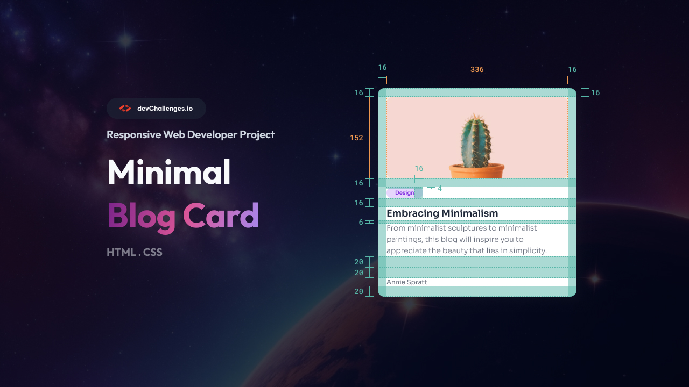

<!-- Please update value in the {}  -->

<h1 align="center">Minimal Blog Card | devChallenges</h1>

   Solution for a challenge <a href="https://devchallenges.io/challenge/minimal-blog-card" target="_blank">Minimal Blog Card</a> from <a href="http://devchallenges.io" target="_blank">devChallenges.io</a>.

  <h3>
    <a href="{https://your-demo-link.your-domain}">
      Demo
    </a>
     | 
    <a href="{https://your-url-to-the-solution}">
      Solution
    </a>
     | 
    <a href="https://devchallenges.io/challenge/minimal-blog-card">
      Challenge
    </a>
  </h3>

<!-- TABLE OF CONTENTS -->

## Table of Contents

- [Overview](#overview)
- [What I learned](#what-i-learned)
- [Built with](#built-with)
- [Useful resources](#useful-resources)

<!-- OVERVIEW -->

## Overview

This is a minimal blog card by devchallenges.io. This website contains a picture of a cactus, a rectangle with design on it, a heading, content and the original author's name. 

### What I learned

In this project, I practiced and refreshed my knowledge about margin and padding. I also learned about Flexbox and centering the divs and positioning them in the center and making them responsive and move based on how large the window is. 

### Built with

- Semantic HTML5 markup
- CSS custom properties
- Flexbox

### Useful resources

- GeeksforGeeks: (geeksforgeeks.org): This helped me figure out the difference between margin and padding during the course.
- devchallenges.io (devchallenges.io): This provided the project and helped me a lot in my coding skills by creating real world projects and practice my coding skills to make even better projects in the future. 
